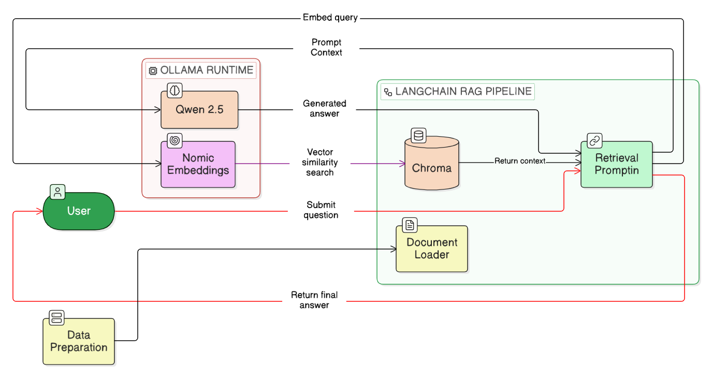

<div align="center">
  <a href="https://github.com/HuyinCP/Ollama-Flask-Assistant">
    <picture>
      <source media="(prefers-color-scheme: dark)" srcset=".github/images/logo-dark.svg">
      <source media="(prefers-color-scheme: light)" srcset=".github/images/logo-light.svg">
      
    </picture>
  </a>
</div>

<div align="center">
  <h3>An AI assistant and high-performance crawler for Shopee's Knowledge Base.</h3>
</div>

<div align="center">
  <a href="https://www.python.org/" target="_blank"></a>
  <a href="https://flask.palletsprojects.com/" target="_blank"></a>
  <a href="https://python.langchain.com/" target="_blank"></a>
  <a href="https://ollama.com/" target="_blank"></a>
</div>

<br>

This project is an internal AI Assistant system (powered by Ollama) designed specifically to analyze and provide support answers based on the Knowledge Base of the **Shopee Help Center**.

> [!TIP]
> Want to understand the system workflow clearly? Check out the **[Architecture Documentation](docs/ARCHITECTURE.md)** — a detailed guide describing how the Crawler and AI Assistant integrate.

## Tech Stack

| Category | Technologies |
|----------|--------------|
| 🧠 **LLM Orchestration** |  |
| 🔌 **LLM Provider** |  |
| 🗄️ **Vector & Storage** |  |
| 📐 **Embedding & Reranking**|  |
| ⚡ **Backend** |   |
| 📊 **Evaluation & Testing**|  |

## System Architecture



## Project Structure

```
Smart Assistant/
├── config.py                  # Centralized config: models, params, prompts, paths
├── app.py                     # Flask entry point (Web UI)
├── modules/                   # Business logic (RAG pipeline)
│   ├── __init__.py            # Export public API
│   ├── data_loader.py         # Read Markdown from data/shopee/
│   ├── data_processing.py     # Chunking + Vector Store (Chroma)
│   ├── llm_interface.py       # ChatOllama + OllamaEmbeddings
│   └── query_engine.py        # RAG chain (retrieve → prompt → LLM)
├── scripts/
│   └── shopee_crawler.py      # Crawler for Shopee data
├── data/shopee/               # 535+ Markdown Knowledge Base files
├── templates/ & static/       # Flask frontend
├── tests/                     # Pytest
└── requirements.txt
```

## Installation

```bash
pip install -r requirements.txt
ollama pull qwen2.5:7b
ollama pull nomic-embed-text
```

## API Reference

| Endpoint | Method | Description | Request Body | Response |
|----------|--------|-------------|--------------|----------|
| `/api/chat` | `POST` | Ask a question and get a response based on the Knowledge Base. | `{"message": "..."}` | `{"answer": "...", "sources": ["..."], "duration": 1.23}` |

## LLM & Embedding Providers

The project currently uses **Ollama** as the provider for both the LLM and the Embedding model. These are configured in `config.py`.

### LLM Provider

| Provider | `LLM_MODEL_ID` | `OLLAMA_HOST` | Cost |
|----------|----------------|---------------|------|
| Ollama | `qwen2.5:7b` (default) | `http://localhost:11434` | Free |

### Embedding Provider

| Provider | `EMBEDDING_MODEL_ID` | `OLLAMA_HOST` | Cost |
|----------|----------------------|---------------|------|
| Ollama | `nomic-embed-text` (default) | `http://localhost:11434` | Free |

You can modify the models used by changing `LLM_MODEL_ID` and `EMBEDDING_MODEL_ID` inside `config.py`.

## ## Deployment: Dự án này sẽ được deploy trên AWS EC2..