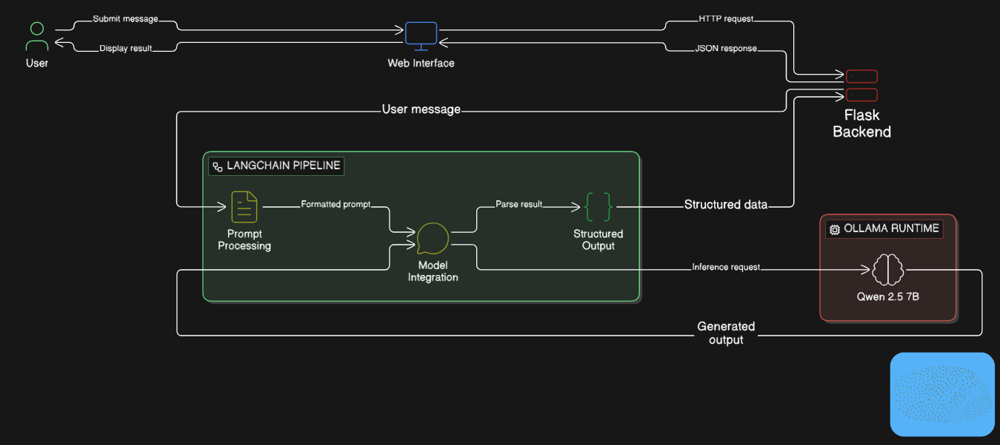
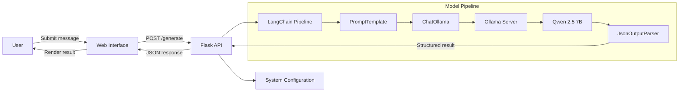

<div align="center">

<a href="https://docs.langchain.com/oss/python/langchain/overview">
  <picture>
    <source media="(prefers-color-scheme: dark)" srcset=".github/images/logo-dark.svg">
    <source media="(prefers-color-scheme: light)" srcset=".github/images/logo-light.svg">
    
  </picture>
</a>

# Ollama Flask Assistant

**A local AI assistant for structured customer inquiry analysis.**

[](https://www.python.org/)
[](https://flask.palletsprojects.com/)
[](https://python.langchain.com/)
[](https://ollama.com/)

</div>

Ollama Flask Assistant is a local LLM-powered web application built with **Flask**, **LangChain**, and **Ollama**. It analyzes a customer message and returns a structured summary, sentiment score, recommended action, and suggested response all without sending prompts to an external model provider.

> [!TIP]
> This project uses `qwen2.5:7b` by default. Switch to another Ollama chat model by changing `MODEL_ID` in `config.py`.

## Quickstart

### Prerequisites

- Python 3.12
- [Ollama](https://ollama.com/) installed and running

### Install

```powershell
ollama pull qwen2.5:7b

py -3.12 -m venv venv
.\venv\Scripts\Activate.ps1

pip install flask langchain-ollama langchain-core pydantic
```

### Run

```powershell
python app.py
```

Open [http://127.0.0.1:5000](http://127.0.0.1:5000) in your browser.

To test the model pipeline without the web interface:

```powershell
python llm_test.py
```

## Architecture

<div align="center">



</div>

<details>
<summary>Mermaid version (renders on GitHub)</summary>



</details>

### Request flow

1. The user enters a message and submits it in the browser.
2. `static/script.js` sends `{ "message": "..." }` to `POST /generate`.
3. `app.py` validates the request and calls `qwen_response()` with the system prompt and user message.
4. `model.py` runs the LCEL pipeline:

   ```text
   PromptTemplate | ChatOllama | JsonOutputParser
   ```

5. `PromptTemplate` combines the system prompt, user message, and JSON formatting instructions.
6. `ChatOllama` sends the formatted prompt to the local `qwen2.5:7b` model.
7. `JsonOutputParser` converts the model output into a structured Python dictionary.
8. Flask adds the processing duration and returns the result to the browser.
9. The interface renders the response and analysis metadata.

### Response format

```json
{
  "summary": "The user needs help resetting a password.",
  "sentiment": 50,
  "action": "Provide password reset instructions.",
  "response": "Use the Forgot Password link on the sign-in page.",
  "duration": 2.31
}
```

## Project components

- **Web interface** — Collects messages and displays the generated response and analysis.
- **Flask API** — Validates requests, invokes the model pipeline, and returns JSON.
- **LangChain LCEL** — Connects prompt formatting, model inference, and output parsing.
- **Ollama** — Hosts and runs the model locally.
- **Qwen 2.5** — Generates the structured customer inquiry analysis.

## Why this project?

- **Local inference** — Prompts are processed by Ollama on your machine.
- **Structured output** — Pydantic and `JsonOutputParser` produce a predictable response shape.
- **Model flexibility** — The configured Ollama model can be replaced without changing the Flask routes.
- **Clear separation of concerns** — UI, API, configuration, and model logic live in separate modules.
- **Simple development workflow** — The model pipeline can be tested independently through `llm_test.py`.

## Project structure

```text
Ollama-Flask-Assistant/
├── app.py                 # Flask application and routes
├── config.py              # Model settings and system prompt
├── model.py               # LangChain pipeline and output schema
├── llm_test.py            # Standalone model test
├── templates/
│   └── index.html         # Chat page
└── static/
    ├── script.js          # Browser request and rendering logic
    └── styles.css         # Interface styles
```

## Roadmap

Planned directions to grow this assistant from a single-turn analyzer into a full retrieval-augmented, multimodal, agentic application:

- [ ] **Retrieval-Augmented Generation (RAG)** — Ground responses in a knowledge base so the assistant can answer from your own documents.
- [ ] **Vector database integration** — Store and retrieve embeddings (e.g. Chroma, FAISS, or Qdrant) to power semantic search over support content.
- [ ] **Advanced RAG** — Add retrievers, re-ranking, and citation of source passages for more accurate answers.
- [ ] **Multimodal input** — Accept images alongside text (e.g. screenshots of an error) using a multimodal Ollama model.
- [ ] **AI agents** — Let the assistant call tools (order lookup, refund processing) instead of only suggesting an action.
- [ ] **Agentic workflows with LangGraph** — Orchestrate multi-step reasoning and stateful conversations with LangChain + LangGraph.
- [ ] **Conversation memory** — Maintain multi-turn context across a chat session.

> [!NOTE]
> These directions follow the learning path from *Develop Generative AI Applications: Get Started* — moving toward RAG, multimodal, and agentic applications.

## Next Steps

Ideas to further enhance the application and your skills:

- **Implement caching** — Cache repeated queries to improve performance and reduce model calls.
- **Explore advanced LangChain features** — Add memory to maintain conversation context across turns.
- **Add more models** — Integrate other chat models (e.g. additional Ollama models or other providers).
- **Implement A/B testing** — Compare responses from different models for the same query.
- **Enhance error handling** — Add more robust error handling and structured logging.
- **Explore cloud services** — Consider integrating cloud services to expand the application's capabilities.

## Resources

- [Ollama documentation](https://docs.ollama.com/)
- [LangChain Python documentation](https://docs.langchain.com/oss/python/langchain/overview)
- [Flask documentation](https://flask.palletsprojects.com/)
- [Qwen 2.5 model on Ollama](https://ollama.com/library/qwen2.5)
